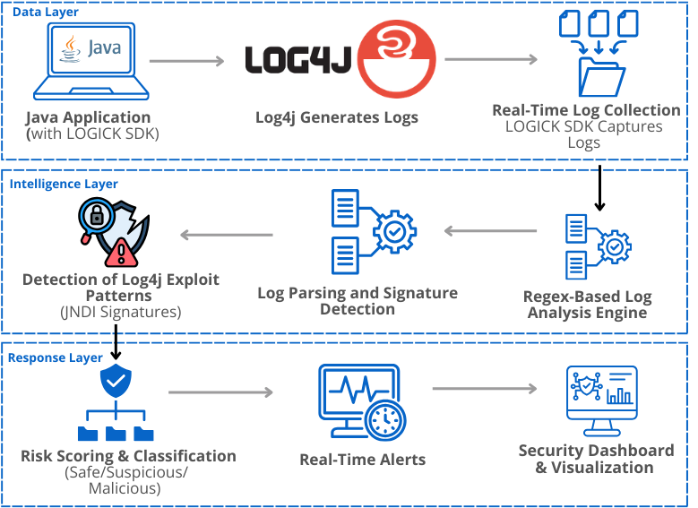

  

# LOGICK

LOGICK is a log-level security monitoring tool designed to detect Log4Shell and related Log4j exploit attempts directly from application logs. Instead of relying on network-level monitoring, LOGICK works where the attack actually appears — inside logs — allowing early detection of malicious payloads before serious damage occurs.

LOGICK provides a lightweight SDK that integrates with Java applications using Log4j. The SDK automatically captures logs, securely sends them to the LOGICK backend, and analyzes them using a regex-based detection engine to classify logs as safe, suspicious, or malicious. The results are displayed in a centralized dashboard for real-time monitoring and investigation.

This project demonstrates how legacy Java applications can be protected using log-level monitoring without modifying existing business logic.

---

## Project Components

**LOGICK SDK**
A Java SDK published to Maven Central that integrates directly with Log4j-based applications. It captures logs and securely forwards them to the backend.

**LOGICK Backend Server**
A Node.js server that receives logs, analyzes them using a regex detection engine, and stores structured results.

**Detection Engine**
A regex-based signature detection engine that identifies Log4Shell payloads, including obfuscated and nested JNDI exploit patterns.

**Dashboard**
A React-based web dashboard that visualizes logs, shows attack statistics, and helps users monitor application security in real time.

**Log4j Simulation Environment**
A controlled vulnerable application used to simulate Log4Shell attacks and validate detection capability.

---

## How LOGICK Works

1. The application integrates the LOGICK SDK.
2. The SDK captures logs automatically from Log4j.
3. Logs are securely sent to the LOGICK backend server.
4. The detection engine analyzes logs using exploit signatures.
5. Logs are classified as **safe**, **suspicious**, or **malicious**.
6. Results are displayed in the LOGICK dashboard.

---

## Repository Structure

| Repository | Description |
|---|---|
| `LogicK-NodeJs-Server` | Backend server for authentication, log ingestion, and analysis |
| `LogicK-sdk` | Java SDK that integrates with applications and sends logs |
| `logick-dashboard` | Frontend dashboard for monitoring and visualization |
| `lo4j-simulation` | Vulnerable Log4j application used to simulate exploit attacks |

---

## Architecture Diagram

Refer to the architecture diagram to understand how LOGICK components interact, including SDK integration, backend analysis, database storage, and dashboard visualization.

  

> Architecture Diagram of LOGICK

---

## Documentation

Full technical documentation, SDK usage, architecture details, and detection engine explanation are available in the LOGICK GitBook.

> GitBook Documentation:[ *(Link)*](https://anisha.gitbook.io/logick)
> LOGICK SDK:[ *(Link)*](https://central.sonatype.com/artifact/io.github.niraj2036/logick-java)

---

## Demo Video

Watch the complete demo showing exploit simulation, detection, and dashboard monitoring.

> Demo Video: *(Add your YouTube demo link here)*

---

## Dashboard Preview

The LOGICK dashboard provides:

- Real-time log monitoring
- Attack detection visibility
- Malicious log identification
- Security analysis metrics

> Screenshots: *(Add dashboard screenshots here)*

---

## Key Features

- Detects Log4Shell exploit attempts in real time
- Lightweight Java SDK integration
- Regex-based signature detection engine
- Centralized log monitoring dashboard
- Secure authentication using client credentials
- Published SDK via Maven Central
- Designed for legacy Java application environments

---

## Purpose

LOGICK focuses on early detection at the log level, turning silent exploit attempts into visible alerts and helping organizations monitor vulnerable applications without requiring immediate patching.

---
## Contact: 

  

- [Tejas Gadge](https://www.linkedin.com/in/tejas-gadge-8a395b258/)
- [Anisha Shankar](https://www.linkedin.com/in/anisha-shankar-/)
- [Niraj Chaudhari](https://www.linkedin.com/in/niraj-p-chaudhari/)
- [Ganesh Shelar](https://www.linkedin.com/in/ganesh-shelar-2190ab294/)
